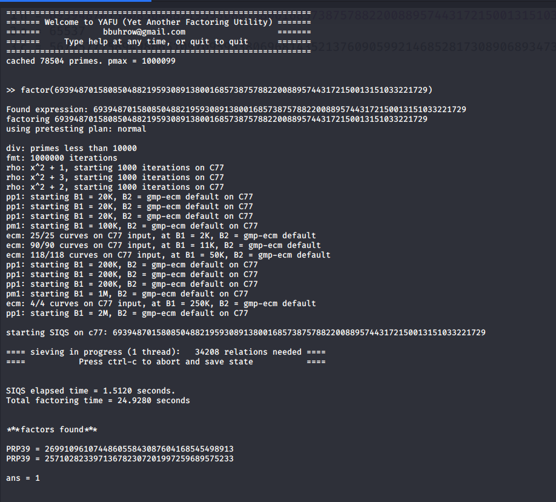

# Crypto Challenges

## AbXORb The Energy
```
I met Bhargav and his friend Sanky at the supermarket, to see them purchasing an energy drink.
After asking what was the energy drink, they replied in a monotone "....". What was their reply?
```

+ The challenge name has a hint about the XOR operation
+ Two images were provided. XORing them out would give out the flag.
+ Solution:
```bash
convert sup5.jpg 16.png -fx "(((255*u)&(255*(1-v)))|((255*(1-u))&(255*v)))/255" res_chk.jpg
```
+ Flag:
```
CTF{b0057_15_7h3_53cr37_0f_0ur_3n3rgy}
```
___

## Bobby and Alice
```
Alice gives Bobby a new encrypted message.
She tells him that she encrypted CTF{xxxx} and that those 'x' are lowercase.
Bobby now challenges you to decrypt the message.
Can you do it?
```
+ Here it was given that CTF{xxxx} was encrypted using RSA algorithm.
+ Since we have the cipher text and the values of n and e, we can try out all 4 letter permutations and place between 'CTF{' and '}'.
+ By encrypting all the permutations and comparing it with the cipher text we can get the right combination which gives us the flag.
+ The python code which could be used is as follows:

```
from Crypto.Util.number import *

n = "given"
e = "given"
c = "given"

alpha = "abcdefghijklmnopqrstuvwxyz"
for i in alpha:
	for j in alpha:
		for k in alpha:
			for l in alpha:
				flag = "CTF{" + i + j + k + l + "}"
				flag_enc = pow(bytes_to_long(flag.encode()), e, n)
				if flag_enc == c:
					print("The flag is " + flag)
					exit(0)
```
+ Flag:
```
CTF{leet}
```

___

## The Final Gambit
```
Bobby decides to take the matter in his own hands.
He encrypts the key using RSA encryption.
Since his message is long he uses 256 bit public key.
Can you decrypt the cipher?
```
+ Here the flaw of RSA is that it uses 256 bit keys which can be easily cracked by modern tools.
+ One of the tools which can be used to crack the RSA is called YAFU.
+ Since 'n' is small, YAFU can factorize it into 'p' and 'q' in minutes.
+ With the help of 'p' and 'q' we can use online web tools which will generate 'd'.
+ Then using 'd' we can do pow(c,d,n) to get the message.

+ Flag:
```
CTF{Y0u'r3_4_tru3_crpt0_l33t}
```

## Shouldn’t have skipped algebra class Pt. 2 

### Answer:

+ When you solve the equation you get the answer as 32. 
+ [Tutorial](http://tutorial.math.lamar.edu/Solutions/Alg/SolveExpEqns/Prob9.aspx)
+ b = 4, c = 7
+ From this, you need to infer that the encryption used is Base 32
+ You need to apply the Base 32 encryption to the input string which is hex
+ Something to note:
   + If you try to directly paste the input string in a converter online, it’ll probably recognise it as an ASCII string. This is misdirection, if you try to apply base 32 to the ascii string, it’ll give you the incorrect flag. 
   + You can avoid this by writing your own code for it, which usually does the trick.
   + Also a note to be made, flags always need not be human readable. People tend to think they are, but that isn't necessary.
   + Here's the actual flag:
   + CTF{Q4TPN5WUSJ3N6M2YTFXXK4RAMJZGC2LOEBWGS23FENXW433VOMQAEBVWS3DMNFTBEBYG62LW25LTM===}

___

## Some cypher cryptography

INGXROK, ZNK TUZK EUA YKTZ UBKX CGY ZXOIQOKX ZNGT O KDVKIZKJ. PGSKROG JOJT’Z PAYZ XKBKXYK ZNK CNURK SKYYGMK HKLUXK KTIXEVZOTM OZ, YNK VAZ GRR ZNK VATIZAGZOUT GTJ YVGIOTM HGIQ OT ZNK UXOMOTGR VRGIKY ZU ZNXUC ZNK IGYAGR XKGJKX ULL ZNK YIKTZ. OZ CGYT’Z BKXE YUVNOYZOIGZKJ, HAZ OZ CGY JKBOUAY, GTJ ZKRRY AY YUSKZNOTM GHUAZ ZNK CGE YNK ZNOTQY. UTK ZNOTM O GS IKXZGOT GHUAZ, ZNOY JUKYT’Z XKGJ ROQK G YAOIOJK TUZK. CNU CXOZKY UTK UL ZNUYK OT IUJK? UAX LOKRJ GMKTZ GYQKJ GXUATJ GZ ZNK ATOBKXYOZE GTJ CGY ZURJ ZNGZ PGSKROG’Y HUELXOKTJ CUXQKJ OT ZNK YGSK RGH GY NKX LUX G CNORK. NOY TGSK OY SGXZOT ZXGETUX GTJ ZNKE HUZN JOJ GT OTZKXTYNOV OT ZNKOX YKIUTJ EKGX GZ G YVOTUAZ IUSVGTE IGRRKJ JETGSOD. ZNGZ OY G YSGRR YZGXZAV CNOIN CUXQY UT ZNK LXOTMKY UL ZNK GXSY OTJAYZXE, HAZ TU-UTK YKKSY ZU QTUC SAIN GHUAZ OZ. O GS TUZ YAXK CNE JETGSOD CUARJ NGBK NOXKJ PGSKROG; EUA YGOJ ZNGZ YNK CGY CUXQOTM UT MXGBOZE CGBKY, CNOIN GXK G YKOYSURUMOIGR VNKTUSKTUT. O XKGJ GT OTZKXKYZOTM VGVKX IGRRKJ “MXGBOZE CGBKY OT KGXZNWAGQKY” CNOIN YAMMKYZKJ ZNGZ ZNKE SOMNZ HK XKYVUTYOHRK LUX ZNK JKYZXAIZOUT UL NOMN XOYK HRUIQY JAXOTM YUSK ZXKSUXY. HAZ ATRKYY JETGSOD GXK VRGTTOTM ZU ZXE ZU CKGVUTOYK KGXZNWAGQKY O GS TUZ YAXK CNE ZNOY CUARJ HK UL OTZKXKYZ ZU ZNKS. CK TKKJ ZU QTUC SUXK GHUAZ NKX CUXQ GTJ CNGZ ZNKE NOXKJ NKX ZU JU.ZNKXK GXK G RUZ UL WAKYZOUTY KBKT OT ZNK LOXYZ TUZK:CNE JOJ SGXZOT RKGBK?CNKXK OY NK?CNE IUARJT’Z YNK MKZ NURJ UL NOS?CNGZ CGY ZUU HOM LUX PGSKROG ZU NGTJRK GRUTK? CNGZ SGJK PGSKROG LKKR MAORZE?NUC CGY YNK VRGTTOTM ZU LOD OZ? O GS NUVOTM ZNGZ ZNK GZZGINKJ JUIASKTZ CORR GTYCKX YUSK UL ZNKYK WAKYZOUTY HAZ OZ CORR VXUHGHRE PAYZ XGOYK UZNKXY. O LUATJ OZ VGYZKJ ATJKX ZNK IUBKX UL ZNK TUZKHUUQ ZNGZ ZNK VXKBOUAY SKYYGMK CGY ZGQKT LXUS. O IGT YKK CNE ZNK VUROIK SOYYKJ OZ, ZNUAMN OZ CGYT’Z G BKXE VXULKYYOUTGR PUH. NGXXE

### Answer:

+ This is Caesar’s cipher, where Shift​ = -6 (‘A’ in cipher text = ‘u’ in plaintext)
+ The actual flag for this challenge was CTF{charlieharry}

___