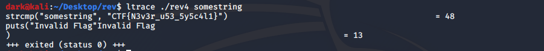
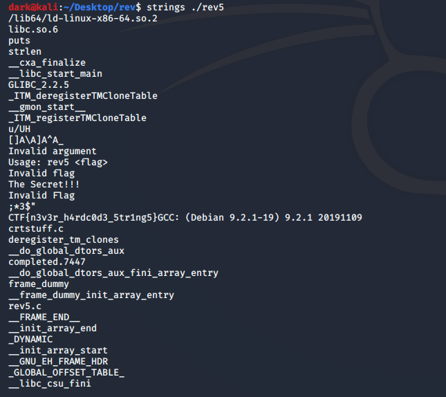
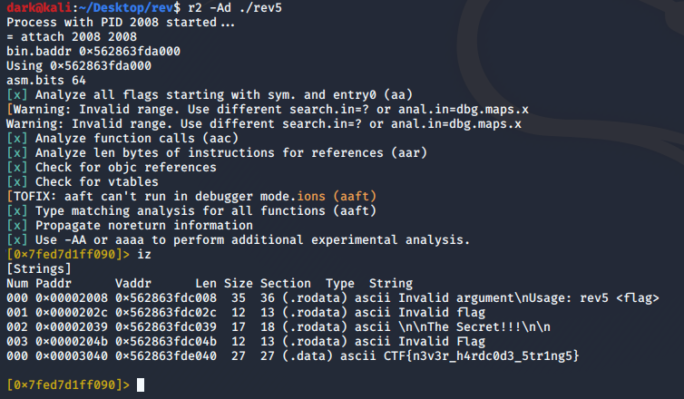
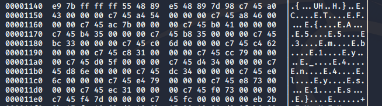

# Rev-Engineering Challenges

## Rev 101
```
Welcome to the world of Reverse Engineering.

Help us find the key to the Secret.
Lucky for you we got our hands on the source code.
Here the key refers to the right flag which unlocks the secret.
```
+ Here upon downloading the source code it is pretty evident that the flag was directly used for comparison.

+ Flag:
```
CTF{1NTR0_T0_R3V}
```

## Still The Basics
```
Found another source code!!
Beware this seems to be a really bad way to do it.
Hope you know your basics?.
```
+ Here strtok is used to split the flag using "_" as separator.
+ A basic rearrangement and adding "_" at the right index will yield the flag.
+ Flag:
```
CTF{4_v3ry_b19_CTF_f14g}
```

## Last Of The Freebies
```
Here is the final source code that we could get our hands on.
This seems to be a cleaner version of the previous code.
Hope you can get the key for us :)
```

+ Here string pointers were used for comparison.
+ Rearrangement of the value used for comparison yield the flag.

+ Flag:
```
CTF{ju5t_4n0th3r_f14g}
```

## The Actual Encounter
```
Unfortunately we don't have access to the source code.
But we still got the executable for you to crack.
Find the key from the file below.
```
+ This time we are provided with the exeutable.
+ From previous challenges we can see that strcmp was used for comparisons which is a library call.
+ We can trace all the library calls we are called when a program is run by using 'ltrace'.


+ From img we can see that the flag is compared directly.

## Rev 202
```
This time it wont be as the last time.
The checks are now done manually.
Can you still work it out?
```
+ This time when we use the ltrace we can notice that only strlen is called and no flag was found.
+ we can use the "strings" command to check if the flag is present.


## Scopes
```
We realized our mistakes and have not used strings.
Do you think you can find it this time?
```
+ When we try strings, we can see that flag is not found.
+ We will now use radare2 to process the executable and check for the flag.
+ We use `r2 -Ad ./rev6` to run the executable in debug mode.
+ In r2 we can type `iz` which searches and lists the global string values.
+ We can see that the flag was declared globally and hence was found using the above command.


## To The Core
```
The mistakes from previous challenges have been fixed.
Care to find the flag which unlocks the secret?
```
+ To find the flag in this challenge we can use 'hexdump'
+ We run the command `hexdump -C ./rev7`
+ We can locate the flag which follows a pattern where a letter 'E' is in between CTF.
+ So we can manually remove 'E' and can get the flag.
