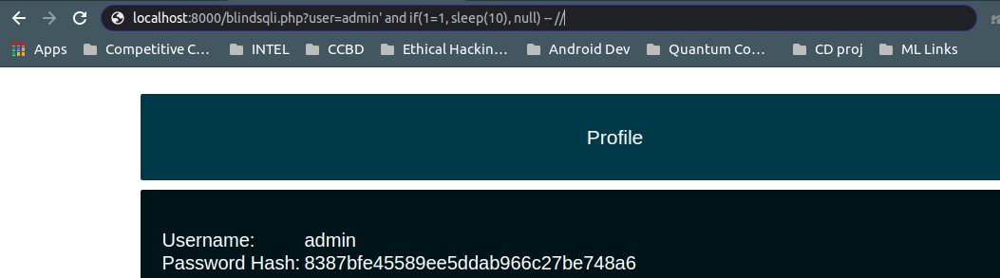
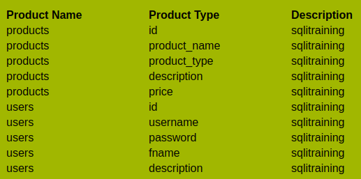
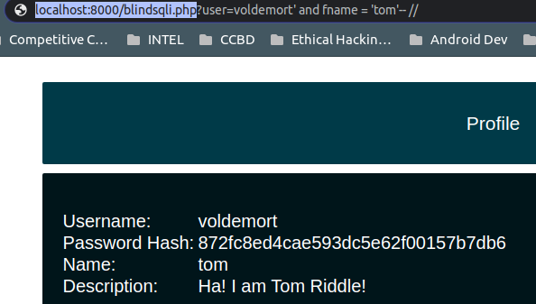

# SQLi Challenges
As you all must've noticed, there were two separate databases being used and hence the challenges were hosted across two websites. One of the DBs used was MySQL and the other was MongoDB. 

## MySQL challenges

### Challenge 1 - Try to login
+ This was the SQL query:
``` $q = "SELECT * FROM users where (username='".$username."') AND (password = '".md5($pass)."')";```
+ Hence the solution will be of the form:
``` blah') OR 1=1 -- // ```
When this is entered in the "username" field, the rest of the query gets commented and you can login as the admin user. 

### Challenge 2 - Take things slow 
+ Here you were expected to conduct a time-based blind SQLi. Essentially, you had to delay the response of the website by 10 seconds. It was also mentioned that you need to conduct this attack on the "Profile Details page"
+ Note: Blind SQLi means the application is vulnerable to SQL injections, but its HTTP responses do not contain the results of the relevant SQL query or the details of any database errors.
+ The SQL query was this:
``` $q = "Select * from users where username = '".$user."'";```
+ The solution is as follows:
``` ?user=admin' and if(1=1, sleep(10), null) -- //```


### Challenge 3 - Find Tom Riddle! 
+ Question: Get access to Tom Riddle's account: A wizard who's first name is tom, goes by the username voldemort.
+ Hints to be picked up - "first name" is tom, "username" is voldemort
+ "first name" and "username" are probably names of columns in the database
+ Confirm this by conducting an SQLi to find column names in the "Search Products" page as follows
``` ' union select null, table_name, column_name, table_schema, null from information_schema.columns where table_schema=database() -- // ```

+ "first name" is actually "fname" and "username" is "username" itself
+ The twist here was, there are two users with the username "voldemort". But only of of them had fname "tom". So you have to write a query that takes care of both these conditions. Add this to the URL:
``` ?user=voldemort' and fname = 'tom'-- //```



