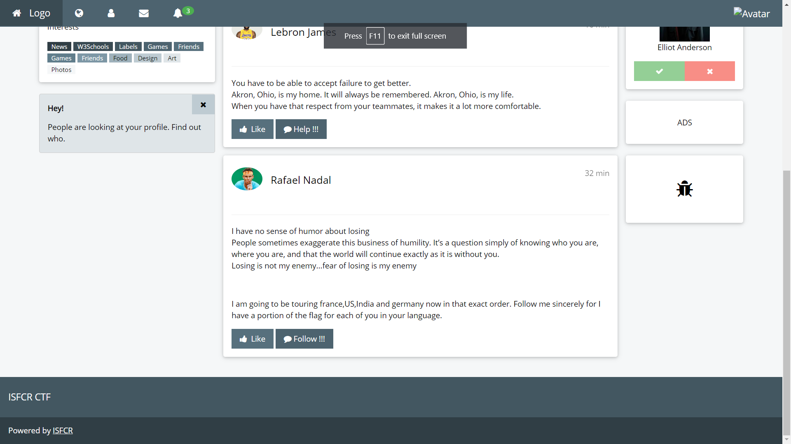

# General - Web


## Lebron

* The challenge asks you to Help Lebron.
* Navigate to the help button in the website beneath a set of quotes by lebron
	
* Click the Help button.
* Intercept the request being sent through Burpsuite or by observing the network tab on the browser.
* You may use postman or curl (Any similar tools) to make a request to the webserver.
* Notice the response headers.
	
* We can observe a content Location header.
* Sending a get Request to the content-Location (/l3bfl4g) or navigating to the page gives the flag.
	

---

## Elliot Alderson

* The Challenge asks you to befriend Elliot Alderson.
* Once you click the green tick.You will be directed to the below page :
	
* A classic reference to Mister Robot (TV series).
* Based on the reference you may navigate to the robots.txt page of the website.
	
* By navigating to the  /.elli0t_fl4g end point you will see some text.
	
* The given text is a JWT token.It can be identified by the three dots injeced inbetween the text.
* Use a JWT online decoder to get the flag.
	
* The given flag field is not of the form CTF{}.
* By noticing the '=' symbol at the end.You man understand that it is base64 encoded.
* Decoding the base64 flag will give you the right flag.
	

---

## Messi

* A social engineering challenge wherein you analyse all the clues in the webpage to guess the password.
* Warning
	* Clues were misleading hence sorry for the inconvenience.
	* The Hint stated : Mac's won't go good with colon's but T's.
	* This should have cleared all the confusion.
* Once you navigate to the web page and like Messi.
* You will be directed to the following page.
	
* Click on Forgot Password.
	
* Based on the regex and the clues you can guess what the regex means.
* The regex is for Mac addresses in general.
	
* Based on the hint we can come to the conclusion of replacing all the ':' with 'T'.
* Doing this will generate a flag.
* Example Flag : 00T14T22T01T23T45
* Any valid mac address according the regex with the colon replaced by T's will work.
* Upon entering the right password.
	
---

## Nadal

* Browse the page to the section on Nadal.
	
* Warning :
	* While coding up the backend I forgot to tie the follow button to the corresoponding endpoint.
	* This error was corrected immediately in the form a hint stating the request types as well as where the request had to be sent.
* Based on the last two lines it can be inferred that multiple request have to be sent to the webserver with appropriate language headers.
* Since the country has been mentioned it is country specific.
	 
	 
	 
	 
* Combining all the recieved bits of the flag in the order mentioned by Nadal will generate the flag.
 
---

## I'm Back

* Navigae to the page.
* Click on the get flag button.
* You will notice an error.
	
* You may open the Main_JS file where the error is.
* If you open the Main_JS File you will observe the following.
[Main_JS](Files/Main_JS.js)
* The Given code snipppet is a JSFuck script.
* Converting it to JS.
* You can get the flag.
	 

___

## Restricted Entry

### Challenge Description

Opening the site tells us that we don't have the authentication to view further. We need to see how the site is authenticating a user to figure out what to do.

### Hint

```
Viewing the source code almost always helps.
```

### Solution

The script tag in the body of the HTML file shows us that it's fetching a local storage item called authKey, and passing it to the atob() function, which used to get plaintext from BASE64, and comparing it to "admin". Therefore, we encode "admin" in Base64 and store it in the local storage key value pair. This gets us the key ***CTF{W3ak_@uth3nt1cat10n}*** 

---

## Message from the Future

### Challenge Description

The site tells us there's a message, but since it's from the future it can only be accessed on an iPhone 30. We need to find out how to access the message

### Hint

```
Again, viewing the source code works.
```

### Solution

The script tag in the body of the HTML file shows us a few things. First, it's setting a cookie called 'userType' to 'normal'. This comes in handy later on. The code then makes a post request to /futuremessage, which we need to emulate. However, since we need to use an iPhone 30, we change the User-Agent header of the request to iPhone 30. This then tells us that we don't have admin privileges to view the code. Inspecting the POST function used in the source code, we can see that one of the headers sent is 'cookie' which passes the site's cookies. The cookie was initially called userType set to normal. When we make the POST request, we set a cookie header, and pass "userType=admin" to emulate being an admin. And voila, you get the key - ***CTF{W3lc0m3_t0_th3_futur3}***

---