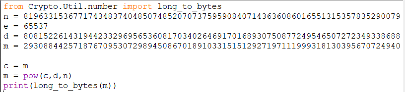

# Bobby and Alice
## Description
Bobby to avenge the loss from the previous CTF approaches Alice who is a RSA expert.
She comes up with a cipher m and gives it to Bobby.
Can you decrypt that message ?

Learn about RSA here: https://en.wikipedia.org/wiki/RSA_(cryptosystem)

+ We know that the Cipher given was RSA based on the description.
+ Here the value of 'm' was actually the cipher 'c' which was mentioned in wikipedia.
+ We can see that Alice had given the private key as well (the mistake!!).
+ All we needed to do was use the formula mentioned in the wikipedia
+ The message is also in long int. Hence we use long_to_bytes() from Crypto.Util.number.
+ The python code used to decode

