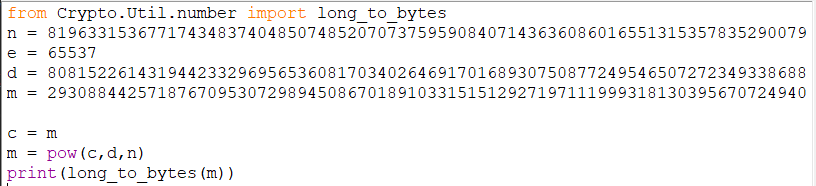

# Cryptography Challenges

# Shouldn’t have skipped algebra class Pt. 1 

## Answer:

+ When you solve the equation you get the answer as 64. 
+ [Tutorial](http://tutorial.math.lamar.edu/Solutions/Alg/SolveExpEqns/Prob7.aspx)
+ b = 4, c = 6
+ From this, you need to infer that the encryption used is Base 64
+ You need to apply the Base 64 encryption to the input string which is hex
+ Something to note:
   + If you try to directly paste the input string in a converter online, it’ll probably recognise it as an ASCII string. This is misdirection, if you try to apply base 64 to the ascii string, it’ll give you a human readable string that’s not the correct flag. 
   + You can avoid this by writing your own code for it, which usually does the trick.
   + Also a note to be made, flags always need not be human readable. People tend to think they are, but that isn't necessary.

   + Here's the actual flag:
   + SSdtIGtpbGxpbzNYmW91ciBicmFpbiBsaWtlIGEgcG9pc29ub3VzIG11c2hyb29t

# Return of the cypher cryptography 

ICROCI, G FZWMSZF YWIE IWRE CJWMF AZCF OWM YCGX GP FZE ZWYDGFCB, CPX SGTEP AZCF ZCY ZCDDEPEX G FZGPU G GF AWMBX JE SWWX FW AWRU FWSEFZER. MPLWRFMPCFEBO GF YEEIY FZCF G CI PWF FZE WPBO WPE FROGPS FW LGPX FZE JWWU. FZERE GY C FZRGTGPS JBCQU ICRUEF CIWPS JGJBGWDZGBEY LWR CPOFZGPS CY WBX CY FZGY. GF GY TERO TCBMCJBE CPX GL FZE JWWU XGYCDDECRY GPFW FZE YZCXWAO AWRBX WL DRGTCFE BGJRCRGEY AE IGSZF PWF YEE GF CSCGP LWR QEPFMRGEY YW GF GY RECBBO GIDWRFCPF AE SEF FW GF LGRYF. FCQGFMY QBECRBO ACPFEX FW ICUE GF XGLLGQMBF FW CYYEIJBE FZE EPFGRE XWQMIEPF, YW ZE ZCX GF ZGXXEP CF C PMIJER WL YGFEY CRWMPX FZE CPQGEPF AWRBX. FZE JRGFGYZ BGJRCRO XEQGXEX FW YEPX YWIEWPE FW FRO FW LGPX CBB FZE DGEQEY. FZEGR EHDERFY LGSMREX FZE QZCDFERY AERE BGUEBO FW JE EPQRODFEX FWW YW, SGTEP IO JCQUSRWMPX, FZEO CYUEX IE FW SW. FZEO AERE RGSZF WL QWMRYE, FZE LGRYF QZCDFER ACY XGYSMGYEX MYGPS C QCEYCR YZGLF CPX FZE YEQWPX JO C YQOFCBE QGDZER, CPX G CI JESGPPGPS FW AWPXER AZCF WFZER QGDZERY FCQGFMY IGSZF QZCBBEPSE MY AGFZ. CY LCR CY AE UPWA FZE RWICPY AWMBX PWF ZCTE ZCX FZCF ICPO FW QZWWYE LRWI. G YMDDWYE ZE IGSZF ZCTE UPWAP CJWMF YWIE LWRI WL FZE DWBOJGMY QGDZER. FZE XWQMIEPFY G ZCTE LWMPX YW LCR (FCQGFMY BCYF FEYFCIEPF CPX QZCDFERY WPE CPX FAW WL ZGY ZGXXEP JWWU) ECQZ SGTE C QBME FW FZE BWQCFGWP WL FZE PEHF WPE, CPX CY YWWP CY FZEO BEF IE WMF WL ZWYDGFCB G DBCP FW FRO FW BWQCFE FZE FZGRX QZCDFER, AZGQZ FCQGFMY FEBBY MY GY ZGXXEP WP FZE GYBE WL FZWRPY. FZERE CRE YETERCB DBCQEY GP FZE CPQGEPF AWRBX FZCF FZGY IGSZF RELER FW, JMF G ZCTE C DREFFO SWWX GXEC WL AZERE GF IGSZF JE. GL G FZGPU WL CPOFZGPS EBYE G AGBB SEF GF FW OWM, CPX CY REKMEYFEX G AGBB QWDO GP OWMR LRGEPX ZCRRO. G YMSSEYF AE FGSZFEP YEQMRGFO C BGFFBE. ICOJE GL AE JBWQU WMR QGDZER FEHFY BGUE FZE EHDERFY GF AGBB DMF WLL QCYMCB GPFERQEDFY. FZE DEWDBE AE CRE MD CSCGPYF CRE MPBGUEBO FW JE XEFERREX JO IMQZ, JMF AE XWP'F ACPF FW GPTGFE EHFRC GPFERBWDERY FW FZE DCRFO. JO FZE ACO, IO LRGEPX GP FZE YWMU FWBX IE FZCF ZE IEF WPE WL OWMR CSEPFY AZW ACY CYUGPS GL ZE UPEA AZERE G ACY, AZGQZ YEEIY C JGF WXX SGTEP FZCF OWM UPWA G CI YFMQU ZERE. ACY FZCF NMYF FW FZRWA WMR RGTCBY WLL FZE YQEPF? CBB FZE JEYF, NWXGE
The flag is the concatenation of the first and last word of this text. The flag is of the format CTF{Concatenated_string}

## Answer: 

   + What you need to do in this question is something known as “frequency analysis”. 
   + You can look it up on google, essentially you try to guess what the most common letters are based on generalised statistics.
   + A good keyword to start with is look at all 3 letter words in the ciphertext and then try to guess which one of those is “the”
   + The flag is CTF{maryamjodie)

# Manual labour for ez points 

この magji Κωδικοποίηση corda ଅଛି been esconder

The 3rd letter of each of the first 6 languages concatenated together makes the flag. The flag is of the format ctf{ Concatenated_string }

## Answer: 

   + You need to find out the different languages used in the input given.
   + Some languages have similar dialects, so you might not get the correct answer in one go. Trial and error
   + Japanese, Albanian, Greek, Portugese, Odia, English, Spanish (7th language so doesn't even matter)
   + Not a lot of logic here, just search and replce.

# 777

+ Remove all the 777's from the cipher text.
+ Convert integer to ascii.
+ To get the flag.

# The National Treasure

## Description

Let's have a little recap of one of the cult classics.
Here we have an Ottendorf Cipher and we will use the same Benjamin Franklin's Silence Dogood letters (https://www.kalh.org/silence.pdf).
Can you decrypt it just like the movies?

+ A video was given as a reference for understanding the Ottendorf Cipher.
+ According to the video, the first number indicated letter/page number, second indicated the line number and third indicated the position of the letter on that line.
+ Hence all we had to do was manually decipher each line in the cipher.txt file.

# Lots!!!

+ Method 1 [Before Hints]
	+ Question Description mentions "First Caesar and his many ciphers"
	+ Not too straighforward but ...
		+ First Caesar - JULIUS [Most commonly used first name of caesar]
		+ Many ciphers - Vigenere cipher is a combination of multipl caesar ciphers.
	+ Solve a vigenere cipher with JULIUS as the key.
	+ Entire cipher text as in caps so mostlikely that Key was also in caps.

+ Method 2 [After Hints]
	+ "What has more caesar ciphers than caesar ciphers itself" - [Could have directly said it was a vigenere cipher]
	+ "First of caesar not just caesar is a key to your problem" - JULIUS is the key
	+ Decrypt Vigenere Cipher to get the answer with key JULIUS.

# Bobby and Alice

## Description

Bobby to avenge the loss from the previous CTF approaches Alice who is a RSA expert.
She comes up with a cipher m and gives it to Bobby.
Can you decrypt that message ?

Learn about RSA here: https://en.wikipedia.org/wiki/RSA_(cryptosystem)

+ We know that the Cipher given was RSA based on the description.
+ Here the value of 'm' was actually the cipher 'c' which was mentioned in wikipedia.
+ We can see that Alice had given the private key as well (the mistake!!).
+ All we needed to do was use the formula mentioned in the wikipedia
+ The message is also in long int. Hence we use long_to_bytes() from Crypto.Util.number.
+ The python code used to decode

