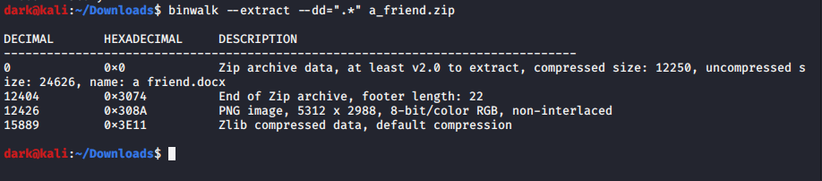

# Forensics

## Website Down for Maintenance
<!---
# Let's Capture
## Description
Here is a wireshark recording of the session.
Can you find out the flag which was exchanged?

+ We are given a wireshark capture which we can view using wireshark.
+ Seeing the packets we can notice that it contains a telnet communication.
+ We can follow the telnet TCP stream and we can see the data which was exchanged.
    
+ From the screenshot we can see that the characters are repeated this is due to the very nature telnet was built on.
+ Eliminating the extras gives us the flag.

# A Friend
## Description
My friend has been acting a little weird lately. He sent me a weird message. 
Can you figure out what's up?

+ We receive a corrupt zip file, when we try to extract is normally we can see only the .docx file.
+ We then have to examine the headers of the zip file, we can do that using binwalk.
    
+ We can see that they are other files included as well.
+ We extract these files using binwalk
    
+ We can then see the below folder.
    
+ Exploring the folder one can find the flag in the .png file.

# Ramp Cat
## Description
Alright. 
We got a picture of ramp cat. 
But we can't find him. 
Find out where he lives for us please?

+ We are given a png file. The image contains the cat in a building. This gives us clue that we need to find this building.
+ We check the metadata of the file using the command  `$ exiftool filename`.
+ We can find the GPS coordinates from the metadata.
+ Converting the coordinates which are in degrees to decimal and we use this decimal coordinates to locate the cat.
+ The GPS point to a building called `Koneko` which is in fact the flag.

# Lost Flash Drive
## Description
I found a flash drive in the street...

+ We are given a file, in order to figure out what it is we use the command `$ file lost_drive`.
    + It will show its a dos/mbr partition.
    + we cant mount directly because of MBR, we have to find offset.
+ We then use the command `$ fdisk -l lost_drive`
    + Start position is 2 and sector size is 512 so we can get offset as 2*512 = 1024.
+ We then create the mounting directory with the command   `$ mkdir /mnt/windows`.
    + This makes a windows folder to mount in.
+ We finally mount it with the command `$ mount -o loop,offset=1024 lost_drive /mnt/windows`.
    + Then navigate to mnt/windows and see the folders and files, extract a zip called passwords and the flag is in it. 

# pdfcrypt
## Description
Hmm.... this PDF file is encrypted. I can't open it... Can you?

+ We are provided with a password protected pdf.
+ We can use johntheripper to unlock this pdf.
+ We first convert the pdf to a hash by the command `$ pdf2john.pl pdfname > pdfname.hash`
+ We then crack this hash using johntheripper `$ john pdfname.hash`.
+ We can provide our custom wordlist as well with the flag --wordlist.
+ Once cracked we can see the password and use that password to open the pdf.
+ Alternately one can visit the site [ilovepdf](https://www.ilovepdf.com/) and uploading the pdf to get the decrypted version.

--->