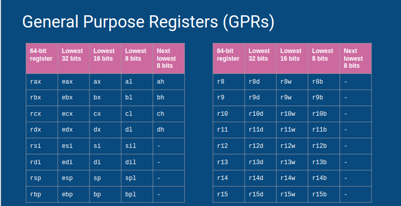

# Linux Challenges

## Website down for maintenance.

# Avengers Assemble:
 + The assembly dump of of 2 functions f1 and f2 stored in a files "f1.out" and "f2.out" respectively
 + There is an instruction which is roughly equivalent to 
 + X = address(Y*4 + Z)
 + where X,Y,Z are all 64 bit general purpose registers.
 + Find the address of this instruction and place it within the brackets of 'ctf{}'

## Register nomenclature
 + in x86 architecture, registers are used with the following nomenclature
 + 
 + credits: Lecture slides for Problem Solving Skills for Engineers - I by Narasimha Datta and Channa Bankapur 

## lea (load effective address) instruction:
 + the lea instruction works as follows:
 	+ lea -3(%rbx,%rbx,8),%rax translates to 
 		+ %rax = address (%rbx * 8 + %rbx) - 3
 		+ viz =>  %rax = address (%rbx * 9) - 3
 	+ the instruction corresponding to this in f1.out is lea 0x0(%rbp,%rax,4),%rdi
 	+ this translates to %rdi = (%rbp * 4 + %rax) + 0
 	+ here %rdi, %rbp, %rax are X, Y, Z respectively

## Reference notes
 + https://cs.lmu.edu/~ray/notes/x86overview/

# Tangled

+ Zip file presented as a Text file.
+ Unzip the file.
+ Run the python script to get the flag.

# B==P B==P ...

+ View the text file.
+ Notice the padded == at the end.
+ The heading of the question was a huge giveaway in itself
+ Decrypt using base64
+ It would again end up as base64.
+ Run it multiple times.
+ Find the number of times needed to decrypt.
+ The correct number is 30.
+ Decrypt 30 times to get the flag.

## Python Script
```
	Python Script to  Determine the Number Of Times to Decrypt

	import base64
	import codecs 

	l = open('flag.txt','r')
	temp = l.read()
	for j in range(100):
	    try:
	        temp = base64.b64decode(temp)
	    except:
	        print(j)
	        break
```
# 100 times
 + There is a secret key (S) stored in a file '-'.
 + There are 2 executables c1, c2
 + To unlock the flag, you have to do the following:
	+ Execute c1, which takes S as input.
	+ Run this 100 times
		+ Feed the output of c1 as input to c2
		+ Feed the output of c2 as input to c1

## Solution:
```
 	#!/bin/sh 
   	LIMIT=100
	INP2=$(python p1.py<./-)
	echo "$INP2" > "inp2"
	while [ "$LIMIT" -ne 0 ]
	do
		INP1=$(python p2.py <inp2)
		echo "$INP1" > "inp1"
		((LIMIT=LIMIT-1))
		echo $LIMIT
		INP2=$(python p1.py <inp1)
		echo "$INP2" > "inp2"
	done
```
## Note: 
 + Initially only binary executables were supposed to be handed out, not python scripts
 + However, due to incompatibility with various architectures and lack of cloud servers to host Linux challenges, we ended up giving the original python scripts. 
 + Hence for this particular case, a python script ( look up OS commands with python) could've also been written to get the desired output. 
 + It is highly advised that you learn shell scripting to tackle such problems in the future.


