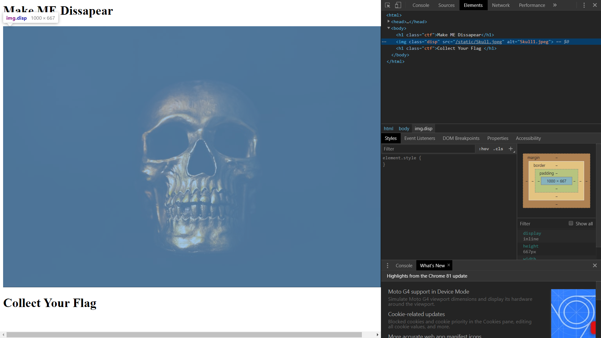
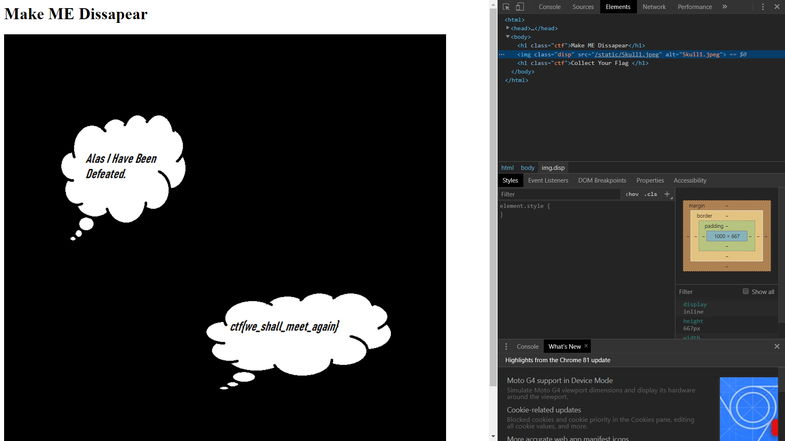
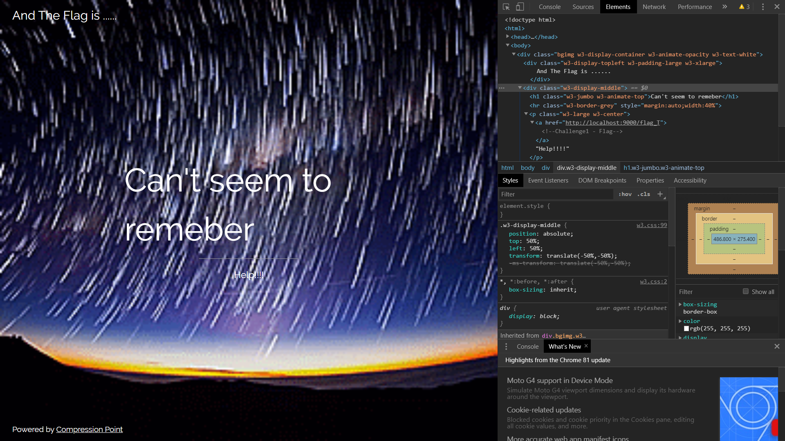
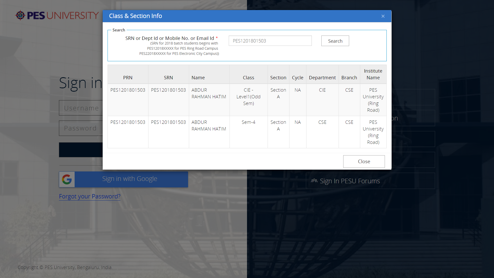
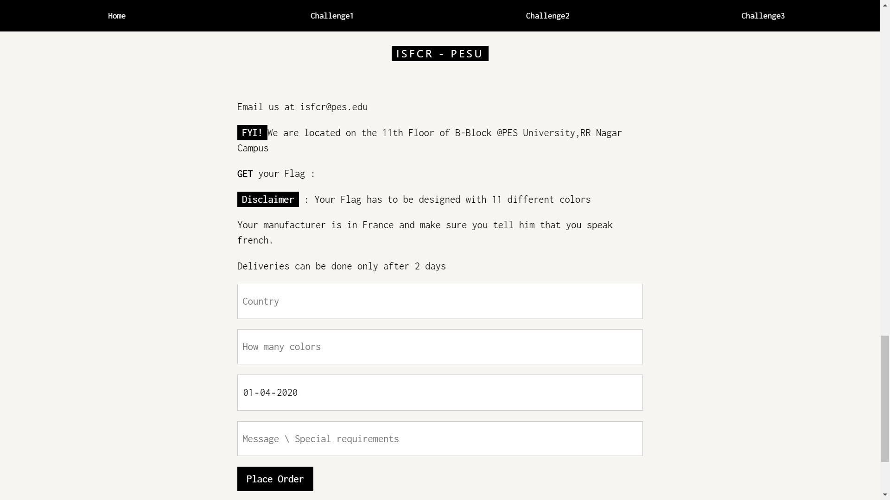

#WEB - CHALLENGES

# Existential Crisis

  + Inspect the page
  
  + See the alt of the image tag
  + Get the file name
  
  + Access the file
  + Copy the flag

# Help!!!

 + Open the Webpage
 + Inspect 
 + Find the hidden Link (There are 2 Links - Must warn the participants)
 
 + Read the flag - (Not too straight forward)
 + The hint what you is not what you get
 
 + CTF{MINDTHEGAP}

# Find ME!!!

+ Go to Site.

+ Method 1
	+ look at robots.txt
	+ Gives you hint to pes website with an apropriate request header
	+ Navigate to the PESU website.
  
	+ Find the appropriate request to get user data based on SRN's.
	+ Guess the correct SRN.
  

+ Method 2	[Not the right way but still a pretty impressive method]
	+ Use the scholarship document providied by college
	+ Seach for the name Hatim
	+ Get the correct SRN.

# Efficient Storage
  + Open the Webpage
  + Inspect 
  + Find the hidden Link (There are 2 Links - Must warn the participants)
  + Method 1
  	+ Website Link mentions compression.
  	+ Huffman coding is a commonly used lossless data compression algorithm.
  	+ Use Huffman coding to get the flag.
  	+ <u style = "color:blue">https://www.dcode.fr/huffman-tree-compression</u>

  + Method 2
  	+ Solving by hand.
  	+ Inorder to make the flag easier to get
  	+ The flag was written based on food products.
  	+ Upon decrypting by hand you will arrive at something that looks like 
  		ctf{Ramen_15_better ...
  	+ Based on this people would have a fair idea of what the flag would be and would hence make the mappin easier.

# Get It!!!

## GET it was designed intentionally to have two methods to solve.
+ Method 1 
	+ Crash the server by passing invalid parameters.
	+ Due to absence of try catch on server side.
	+ Flask code will spill on error logs.
	+ grep the flag or take the flag from error logs.

+ Method 2
	+ Go through the source
	+ Find the Debugging information in the script
	+ Analyse the code snippet to get the id and password
	+ id = armstrong no. of length > 3
	+ password = regex (a)\*bc
	+ Pass the parameters get the request.
	
# Charity is Important

## Charity is important was not supposed to be solved by Method - 1 but it was a bug on our side so...

+ Method 1
  + Crash the server by passing invalid parameters.
  + Due to absence of try catch on server side.
  + Flask code will spill on error logs.
  + grep the flag or take the flag from error logs.

+ Method 2
  + Notice the console logs as soon as you click the text area to place your order.
  + The Request are not created at all hence cannot be intercepted by Burps.
  + But the website asks you to Post your order for charity.
  + The parameters are logged by default as invalid parameters.
  + Upon inspection of the source you can notice that you have been asked to construct the request and the formdata and pass it yourself.
  + Therefore the challenge requires you to donate a rounded up sum of the charity amount to the respective organization.

# Place Your Order

+ Go to challenge3 on the website.
+ Step 1 - Fixing localhost
  + localhost will not work and has to be changed to the site url or location.hostname
  + This will make sure that the request get's sent

+ Step 2
  + Fill in the parameters
  
  + Country = France (Case insensitive - Handled by backend)
  + How many colors : 11 (as requested on the website)

+ Step 3
  + Assigning Delivery date is of atmost importance
  + The date format has wantedly been interchanged in the backend inorder to confuse challengers.
  + Which was later revealed as a hint.
  + It explicitly requires the date to be 2 days after the current date
  + Hence setting the date in the correct format involves trying 3 different permutations.

+ Step 4
  + Tell them you speak french
  +  Set the accept language parameter to fr or fr-ch
  <u style = "color:blue">https://developer.mozilla.org/en-US/docs/Web/HTTP/Headers/Accept-Language</u>

+ Completing the above 4 steps will give you the flag.

